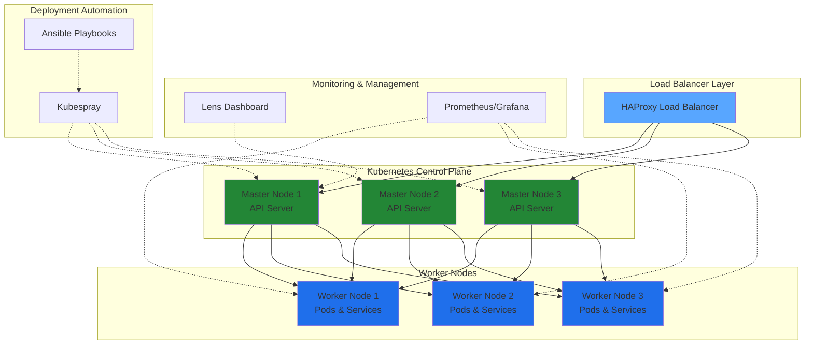
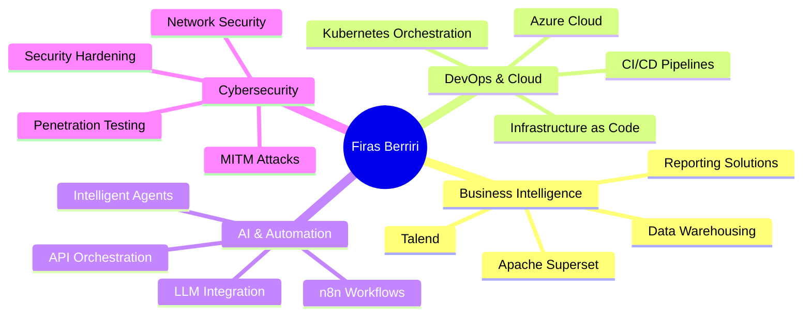

<div align="center">

# 👋 Salut, I'm Mohamed Firas Berriri

### 🚀 Telecommunications Engineer | DevOps Enthusiast | AI & Cloud Explorer

[](https://www.linkedin.com/in/mohamed-firas-berriri-287b06337/)
[](mailto:firasberriri2017@gmail.com)
[](https://github.com/Firas-eng-hub)

*Building intelligent systems at the intersection of DevOps, Cloud, and AI*


</div>

---

## 🎯 About Me

```python
class FirasBerriri:
    def __init__(self):
        self.location = "Tunisia 🇹🇳"
        self.education = "ENIT - École Nationale d'Ingénieurs de Tunis"
        self.role = "Telecommunications Engineering Student"
        self.interests = [
            "Business Intelligence & Data Analytics",
            "DevOps & Cloud Architecture", 
            "AI Workflow Automation",
            "Cybersecurity & Network Defense"
        ]
        self.currently_learning = [
            "Microsoft Azure (Fundamentals Certification)",
            "Kubernetes Orchestration at Scale",
            "LLM Integration & Customization"
        ]
        
    def say_hi(self):
        print("Thanks for dropping by! Let's build something amazing together 🚀")

me = FirasBerriri()
me.say_hi()
```

🔭 **Current Focus**: Building scalable cloud-native solutions, automating workflows with AI agents, and exploring BI tools like Apache Superset and Talend

🎮 **Off-Screen**: Valorant tactician | The Witcher 3 explorer | E-sports enthusiast

---

## 🔨 Now Building

<div align="center">

| 🚀 Project | 📝 Description | 🛠️ Tech Stack | 📊 Status |
|-----------|---------------|---------------|-----------|
| **BI Dashboard Platform** | Building interactive dashboards with Apache Superset for data visualization | Apache Superset, PostgreSQL, Python | 🟡 In Progress |
| **AI SaaS for MENA** | Local-market SaaS product with LLM integration | n8n, OpenAI API, Flask, PostgreSQL | 🟡 In Progress |
| **Azure Cloud Projects** | Learning Azure services while building cloud-native apps | Azure, Docker, Kubernetes | 🟢 Active |
| **Kubernetes HA Cluster** | Production-grade K8s cluster with monitoring & auto-scaling | K8s, Prometheus, Grafana, Ansible | 🟢 Active |

</div>

---

## 🛠️ Tech Stack & Tools

<div align="center">

### 💻 Languages


### ☁️ DevOps & Cloud


### 🤖 AI & Data


### 🔧 Tools & Platforms


</div>

---

## 🚀 Featured Projects

### 🔐 WiFi Security & MITM Attack Simulation
**PFA1 Project (2024-2025)** | *Cybersecurity Research*
- Simulated ARP Spoofing & DNS Spoofing attacks using **Bettercap** and **Ettercap**
- Analyzed network vulnerabilities and implemented defense mechanisms
- Demonstrated practical understanding of network security protocols
- **Tech**: Python, Kali Linux, Wireshark, Network Analysis

### ☸️ High-Availability Kubernetes Cluster Deployment
**DevOps Internship @ L2T (Summer 2024)**

<details>
<summary>🏗️ <b>View Architecture Diagram</b></summary>



</details>

**Key Achievements:**
- Deployed multi-node Kubernetes clusters with **Kubespray**, **Docker**, and **Ansible**
- Implemented HA architecture with HAProxy load balancing
- Managed cluster monitoring and observability using **Lens**
- Established CI/CD best practices for containerized applications
- **Tech**: Kubernetes, Docker, Ansible, Kubespray, HAProxy, NGINX

### 🤖 AI Workflow Automation Platform
**Personal Project (2024-Present)**
- Built intelligent automation workflows for **Email** and **WhatsApp** agents using **n8n**
- Integrated multiple APIs (OpenAI, Gemini) for LLM-powered responses
- Implemented event-driven architectures with webhooks and triggers
- Created low-code BI solutions for productivity enhancement
- **Tech**: n8n, Python, OpenAI API, LangChain, PostgreSQL

### 📸 Arducam Image Processing System
**Academic Project @ ENIT (2024)**
- Developed image capture and processing system with **Arduino** and Arducam sensor
- Performed data analysis and modeling using **MATLAB**
- Implemented embedded systems programming in C/C++
- **Tech**: Arduino, C++, MATLAB, Image Processing

### 🎬 AI-Powered Content Creation
**Creative Exploration (Ongoing)**
- Storyboarding and animating short films using **MidJourney** + **Gen2**
- Exploring AI-driven creative workflows and generative media
- **Tech**: MidJourney, RunwayML Gen2, AI Video Generation

---

## 📊 GitHub Analytics

<div align="center">

<a href="https://github.com/Firas-eng-hub">
  
  
</a>

</div>

---

## 🔥 Streak Stats

<div align="center">

[](https://github.com/Firas-eng-hub)

</div>

---

## 🏆 GitHub Trophies

<div align="center">

[](https://github.com/Firas-eng-hub)

</div>

---

## 📈 Contribution Graph

<div align="center">

[](https://github.com/Firas-eng-hub)

</div>

---

## 📊 Detailed Analytics

<div align="center">

### 📅 Contribution Heatmap
[](https://github.com/Firas-eng-hub)

### 💻 Coding Activity
<!--START_SECTION:waka-->
<!--END_SECTION:waka-->


</div>

---

## 🌍 Visitor Map

<div align="center">

[](https://visitcount.itsvg.in)

</div>

---

## 🏆 Certifications & Achievements

🎓 **Efficient Large Language Model (LLM) Customization** - Hugging Face / DeepLearning.AI (2024)

🎓 **Microsoft Azure Fundamentals** - In Progress (2025)

🎓 **NVIDIA Certificate of Competency** - AI & Deep Learning

🏅 **IEEE ENIT Student Branch** - Active Member & Event Organizer
- Organized **TUNED** (Tech Event) & **League of Coders** (Programming Competition)

🏅 **IEEE Computer Society Chapter ENIT SB** - Treasurer
- Managed finances for **IEEEXTREME**, **WieAct**, **IEEELUMEN** events

🏅 **Enactus ENIT** - Member

---

## 💼 Professional Interests



---

## 📈 What I'm Up To

- 🔭 Exploring **Business Intelligence** tools: Apache Superset, Talend, PostgreSQL
- 🌱 Preparing for **Microsoft Azure Fundamentals** certification
- 💡 Building **SaaS products** for the Tunisian/MENA market
- 🤖 Experimenting with **LLM-powered automation** and AI agents
- 📚 Deep diving into **cloud-native architectures** and scalable backend systems

---

## 🌍 Languages

🇫🇷 **French** - Fluent (B2)  
🇬🇧 **English** - Intermediate (B2)  
🇹🇳 **Arabic** - Native  
🇩🇪 **German** - Basic (A2)

---

## 📫 Let's Connect!

<div align="center">

[](https://www.linkedin.com/in/mohamed-firas-berriri-287b06337/)
[](mailto:firasberriri2017@gmail.com)
[](https://github.com/Firas-eng-hub)

</div>

---

<div align="center">

### 💭 Philosophy

> *"Build with purpose. Break to learn. Repeat to grow."*

**⚡ Fun Fact**: I believe the best solutions emerge at the intersection of automation, intelligence, and creativity!

---

### 📊 Profile Metrics


⭐️ From [Firas-eng-hub](https://github.com/Firas-eng-hub) | *Last Updated: February 2025*

</div>
