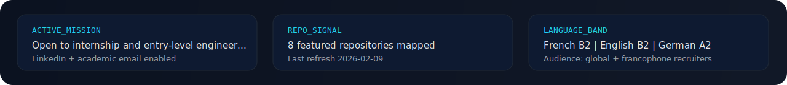
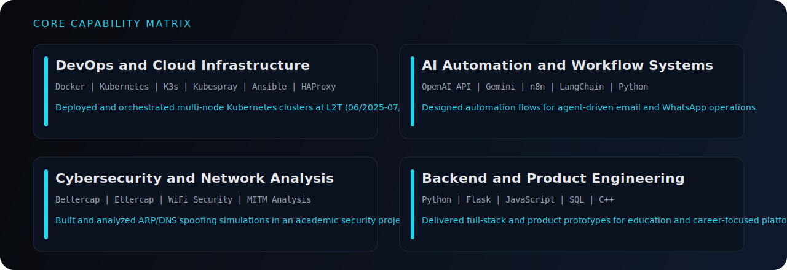
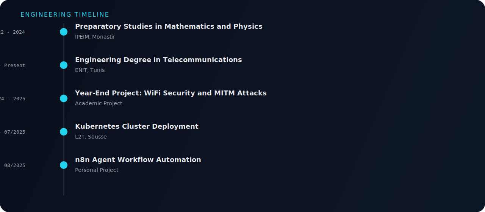

<!-- AUTO-GENERATED by profile/scripts/build-readme.mjs -->

  <picture>
    <source media="(prefers-reduced-motion: reduce)" srcset="./assets/hero-static.svg" />
    
  </picture>

  
  
  

## Mission Briefing

I am an ICT engineering student at ENIT focused on secure infrastructure, cloud-native delivery, and intelligent automation. I build practical systems that combine DevOps discipline, AI workflows, and network security thinking.

- High-availability Kubernetes deployments and platform automation
- AI agents and workflow orchestration with n8n and LLM APIs
- Scalable backend engineering for SaaS-style products

> "Build with purpose. Break to learn. Repeat to grow."

<strong>Version Francaise</strong>

Etudiant ingenieur en telecommunications a l ENIT, je construis des systemes intelligents et automatises a l intersection du cloud, du DevOps, de l IA et de la securite reseau.

- Deploiements Kubernetes haute disponibilite et automatisation plateforme
- Agents IA et orchestration de workflows avec n8n et APIs LLM
- Engineering backend scalable pour produits type SaaS

  

## Capability Matrix

  

| Domain | Stack | Evidence |
| --- | --- | --- |
| DevOps and Cloud Infrastructure | Docker, Kubernetes, K3s, Kubespray, Ansible, HAProxy, NGINX, GitHub Actions | Deployed and orchestrated multi-node Kubernetes clusters at L2T (06/2025-07/2025). |
| AI Automation and Workflow Systems | OpenAI API, Gemini, n8n, LangChain, Python | Designed automation flows for agent-driven email and WhatsApp operations. |
| Cybersecurity and Network Analysis | Bettercap, Ettercap, WiFi Security, MITM Analysis | Built and analyzed ARP/DNS spoofing simulations in an academic security project. |
| Backend and Product Engineering | Python, Flask, JavaScript, SQL, C++ | Delivered full-stack and product prototypes for education and career-focused platforms. |

## Featured Mission Logs

### [Enit_Connect](https://github.com/Firas-eng-hub/Enit_Connect)
- **Role:** Full-Stack Platform
- **Signal:** HTML
- **Impact:** Built a networking platform connecting students, companies, and administrators for internship/job workflows.
- **Updated:** 2026-02-05

### [NIDS-STM32](https://github.com/Firas-eng-hub/NIDS-STM32)
- **Role:** Security and Embedded AI
- **Signal:** Python
- **Impact:** Focused on intrusion-detection experimentation linked to embedded and data-driven workflows.
- **Updated:** 2026-02-03

### [Dataset-NIDS](https://github.com/Firas-eng-hub/Dataset-NIDS)
- **Role:** Data Engineering
- **Signal:** Multi-stack
- **Impact:** Curated security dataset resources for network intrusion analysis pipelines.
- **Updated:** 2026-02-04

### [SINGULARITY-APPLE](https://github.com/Firas-eng-hub/SINGULARITY-APPLE)
- **Role:** TypeScript Product Build
- **Signal:** TypeScript
- **Impact:** Applied TypeScript engineering patterns for product-style implementation.
- **Updated:** 2026-01-25

### [Utopia](https://github.com/Firas-eng-hub/Utopia)
- **Role:** Career Guidance Product
- **Signal:** Python
- **Impact:** Developed a career-oriented application concept focused on practical guidance flows.
- **Updated:** 2025-12-29

### [Gestion-d-intervention](https://github.com/Firas-eng-hub/Gestion-d-intervention)
- **Role:** Operations App
- **Signal:** Dart
- **Impact:** Built intervention-management workflows for industrial operations use cases.
- **Updated:** 2026-01-29

<strong>Operational Projects from CV</strong>

#### Kubernetes Cluster Deployments with Kubespray (06/2025 - 07/2025)
- **Stack:** Kubernetes, Kubespray, Docker, Ansible
- **Outcome:** Provisioned multi-node clusters, services, and pods with automated configuration flow.
- **Reference:** Project details available on request

#### WiFi Security and MITM Simulation (2024 - 2025)
- **Stack:** Bettercap, Ettercap, ARP Spoofing, DNS Spoofing
- **Outcome:** Executed controlled attack simulations to understand network-level vulnerabilities and defenses.
- **Reference:** Project details available on request

#### n8n Agent Automation for Messaging Flows (08/2025)
- **Stack:** n8n, LLM APIs, Automation
- **Outcome:** Designed and orchestrated intelligent workflows for email and WhatsApp agents.
- **Reference:** Project details available on request

## Engineering Timeline

  

| Period | Milestone | Organization |
| --- | --- | --- |
| 2022 - 2024 | Preparatory Studies in Mathematics and Physics | IPEIM, Monastir |
| 2024 - Present | Engineering Degree in Telecommunications | ENIT, Tunis |
| 2024 - 2025 | Year-End Project: WiFi Security and MITM Attacks | Academic Project |
| 06/2025 - 07/2025 | Kubernetes Cluster Deployment | L2T, Sousse |
| 08/2025 | n8n Agent Workflow Automation | Personal Project |

## Certifications and Leadership

### Certifications
- **NVIDIA Certificate of Competency** - NVIDIA

### Leadership and Communities
- **IEEE ENIT Student Branch** (Active Member)
  - Co-organized TUNED tech events
- **IEEE Computer Society Chapter ENIT SB** (Treasurer)
  - Supported IEEEXtreme and IEEE LUMEN operations

### Languages
| Language | Level |
| --- | --- |
| French | B2 |
| English | B2 |
| German | A2 |

## GitHub Signal

  
  

## Contact and Opportunities

- **Target:** Open to internship and entry-level engineering opportunities in DevOps, cloud, security, and AI-enabled systems.
- **LinkedIn:** [Mohamed Firas Berriri](https://www.linkedin.com/in/mohamed-firas-berriri-287b06337/)
- **Email:** [mohamedfiras.berriri@etudiant-enit.utm.tn](mailto:mohamedfiras.berriri@etudiant-enit.utm.tn)
- **Last profile refresh:** 2026-02-09

---

  <strong>Built for internship and job opportunities.</strong> 
  Tactical, evidence-first profile narrative with weekly automation.

